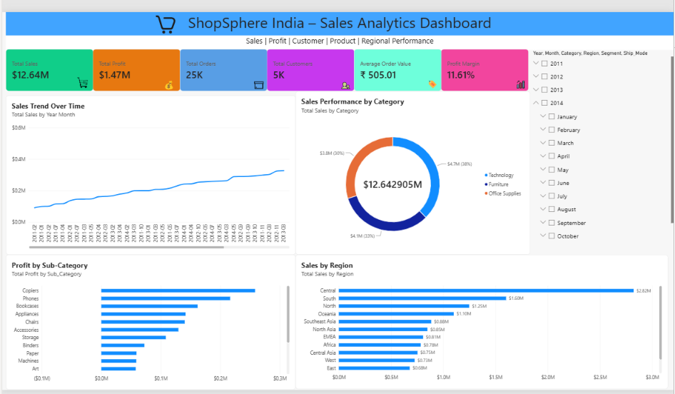
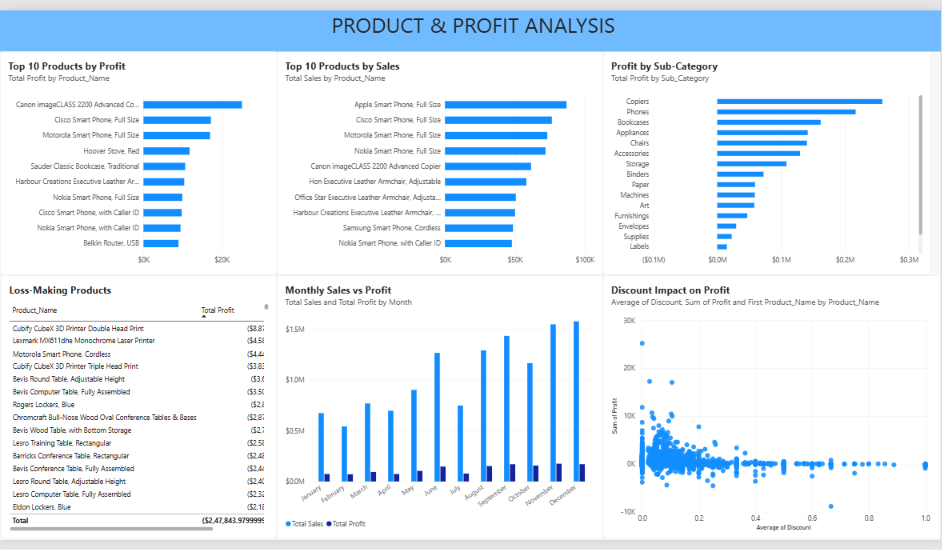
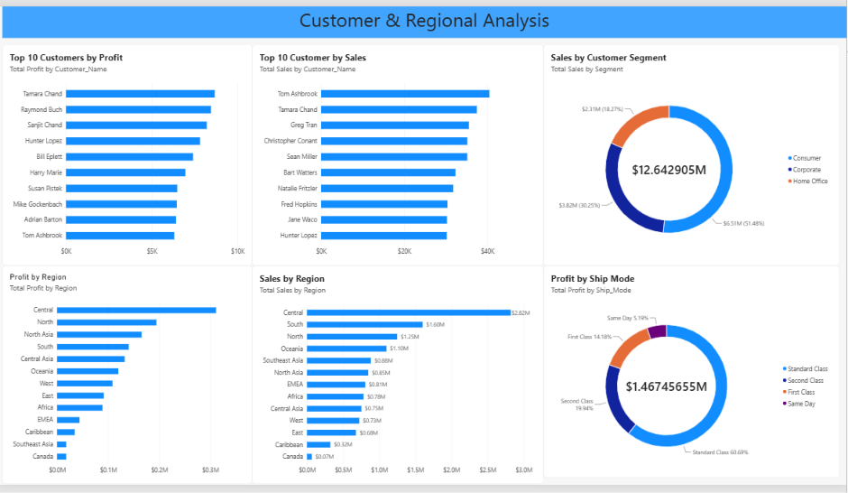
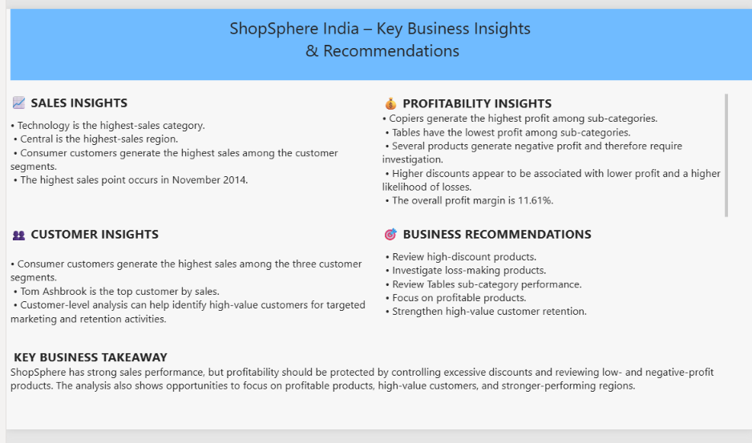

# E-Commerce Sales Analytics — ShopSphere India

## Project Overview

ShopSphere India is an E-Commerce Sales Analytics project focused on analyzing sales, profitability, customers, products, regions, and discounts.

The project uses Excel, MySQL, and Power BI to transform raw sales data into meaningful business insights and an interactive dashboard.

## Business Problem

The business wants to understand:

- Overall sales and profit performance
- Impact of discounts on profitability
- Loss-making products
- Product and category performance
- Customer performance
- Regional performance
- Business growth trends

## Tools & Technologies

- Excel
- MySQL
- SQL
- Power BI

## Project Workflow

Raw Data → Excel Data Preparation → MySQL Analysis → Power BI Dashboard → Business Insights

## Key KPIs

- Total Sales: 12,642,905
- Total Profit: 1,467,456.55
- Total Orders: 25,035
- Total Customers: 4,873
- Total Quantity: 178,312
- Average Order Value: 505.01
- Profit Margin: 11.61%

## Key Insights

### Sales Insights

- Technology is the highest-sales category.
- Central is the highest-sales region.
- Consumer customers generate the highest sales.
- The highest sales point occurs in November 2014.

### Profitability Insights

- Copiers generate the highest profit among sub-categories.
- Tables have the lowest profit among sub-categories.
- Several products generate negative profit.
- Higher discounts appear associated with lower profit and a higher likelihood of losses.

### Customer Insights

- Consumer customers generate the highest sales.
- Tom Ashbrook is the top customer by sales.
- Customer-level analysis can support targeted marketing and retention.

## Business Recommendations

1. Review products with high discounts.
2. Investigate loss-making products.
3. Review Tables sub-category performance.
4. Focus on profitable products instead of sales volume alone.
5. Strengthen customer retention strategies.

## Dashboard

The Power BI dashboard contains four pages:

1. Executive Overview
2. Product & Profit Analysis
3. Customer & Regional Analysis
4. Business Insights

Dashboard screenshots are available in the `Dashboard` folder.

## Project Structure

- Dashboard — Power BI dashboard screenshots
- Documentation — Project documentation and data dictionary
- Excel — Excel data preparation and analysis
- PowerBI — Power BI project file
- SQL — SQL queries and analysis

 ## Conclusion

The analysis shows strong overall sales performance, but profitability can be improved by controlling excessive discounts and investigating loss-making products.
The business should focus on profitable products, review the performance of the Tables sub-category, and strengthen relationships with high-value customers.
Overall, the analysis provides actionable insights that can help ShopSphere India improve profitability, make better pricing decisions, and support data-driven business growth.

## Dashboard Preview

### 1. Executive Overview

### 2. Product & Profit Analysis

### 3. Customer & Regional Analysis

### 4. Business Insights

